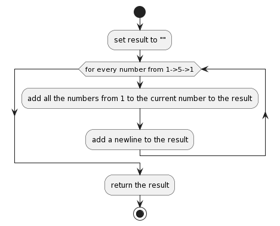
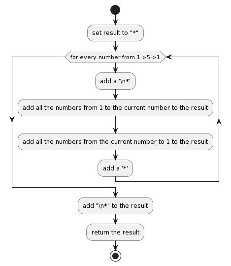
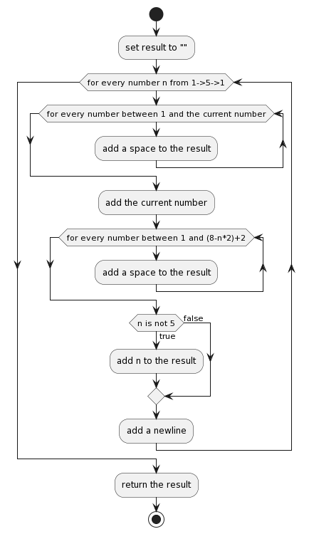

# Pattern 1

*source:*
```js
function pattern1() {
    var res = '';
    nums.forEach((i) => {
        var line = '';
        for (var j=1; j<=i;j++) {
            line += j;
        }
        res += line+'\n';
    })

    return res
}
```
# Pattern 2

*source:*
```js
function pattern2() {
    var res = '*';
    nums.forEach((i) => {
        let line = '' ;
        for (let j = 1; j<=i; j++) {line += j;}
        for (let j = i-1;j>=1; j--) {line += j;}
        res += '\n*'+line+'*'
    })
    return res+'\n*'
}
```

# Pattern 3

*source:*
```js
function pattern3() {
    var res = '\n'
    nums.forEach((i) => {
        var line = '';
        for (let j=1; j<i; j++) {
            line += ' ';
        }
        line += i;
        for (let j = 1; j < (8-i*2)+2; j++) {
            line += ' ';
        }

        if (i != 5) {
            line += i;
        }
        res += line+'\n'

    })

    return res
}
```
